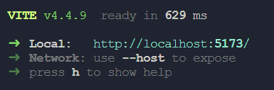

# AT3---Particle-Simulation

---

## 11SDD01 Assessment Task 3 MiniMajor

> No one steal my code... or else

---

1. To run the program you need to install [Node.js](https://nodejs.org/en/download) (if you don't already have it).
2. Next, install a build tool, [Vite](https://vitejs.dev/), using a terminal in the project folder (so in [this folder](../AT3%20-%20Particle%20Simulation/)).

   ```
   npm install --save-dev vite
   ```

3. After installing Vite, run:

   ```
   npx vite
   ```

4. If everything went well, something similar to the picture below should appear in your terminal.
   
5. Now just press 'o' or open <http://localhost:5173/> (or the link shown next to Local).
6. The simulation should now be open!
7. Give me 100% 😏
